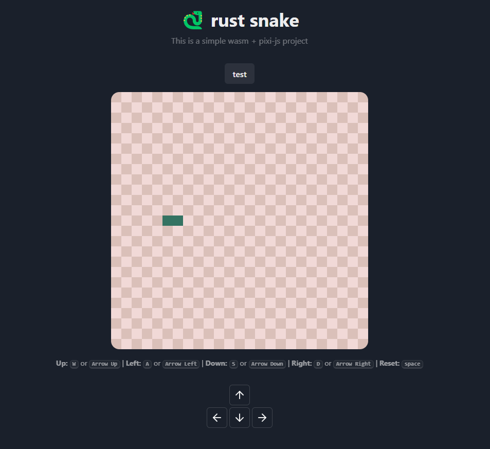

### ❔ About

In this project, I aimed to test WebAssembly's usability in web applications. I have been dithering around the concept
of WASM for a while. In the past, I was never fully able to understand the concept because I was still nascent to the
rust scene. However, now that I've becoming somewhat
proficient in Rust, I decided to see if I could integrate the web technology to a modern framework/library such as
React. It was also a good opportunity to learn a 2D renderer, hence why I also included PixiJS into the scope.

### 💭 Thoughts

I learned a lot from this project; mainly about serializing rust structures into javascript values, interfacing with
rust classes through javascript, and a plethora more that does not relate to the scope. I got most of my information in
this [reference](https://rustwasm.github.io/wasm-bindgen/examples/hello-world.html) documentation.

Unfortunately, on the fifth
day
of working on it, I encountered a road block that
proved to be arduous to resolve. It seems like the struct that I was memoizing in the app through `useRef` is not
persisting when called through a callback. That means that moving the snake through the Rust struct, as far as I know,
is impossible. I have tried to search for resources online regarding integrating WASM to react but didn't find anything
that could help with my problem.

I'm confident I could work around this issue by scrapping the React implementation and using a bare compiler, but that
would no longer aligned with the aim of the project. Hence, I decided that I won't see this project to completion.

The issue I encountered leads me to believe
that, as of right now, the technology is not yet viable or stable enough to be used on web frameworks without extensive
tinkering. WASM strikes me as a utility that allows developers to outsource expensive functions from a more performant
runtime. It's not something that could serve as a full backend for render sequences, like how I was trying to make it
out to be--though that does seem to be a future implementation of it. From what I've searched, it's not really faster
than javascript on common tasks, which greatly reduces its viability for the current industry.

### ✨ Conclusion

WASM is awesome. I had a blast learning how it and its rust packages work. But it doesn't seem to be an all around tool
that will make my web apps run faster. From now on, I'll be experimenting on it more with more utilitarian packages. I
think that's where it really shines. 